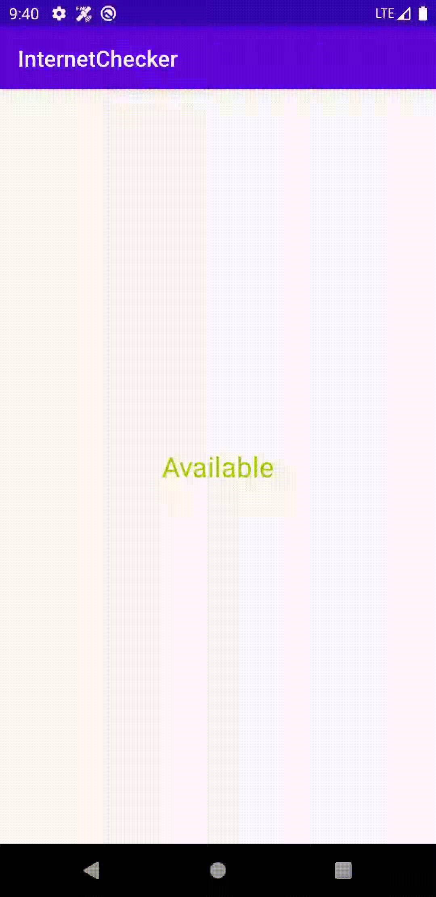

## Network-Connection-Checker
This is a library that allows you to monitor the network/internet connection in your android app




### Requirements
* Minimum supported SDK is 21
* This library only supports projects that have been migrated to androidx

### Usage

1. Add the code to your project's root **build.gradle** file
``` groovy
allprojects {
		repositories {
			...
			maven { url 'https://jitpack.io' }
		}
	}
```

2. Add the dependency to the module level **build.gradle** file

   ``` groovy
    dependencies {
        implementation 'com.github.Emeecodes01:Network-Connection-Checker:v0.1.0'
	}
   ```


3. override onStart in your activity or fragment and register the network monitor

``` kotlin
override fun onStart() {
        super.onStart()
        networkMonitor.register()
    }
```

4. override onStop in your activity or fragment and unregister the network monitor

```kotlin
override fun onStop() {
        super.onStop()
        networkMonitor.unregister()
    }
```

5. Create the NetworkConnectorMonitor instance

``` kotlin
val networkConnectorMonitor = NetworkConnectorMonitor()
```

6. Call the monitor method, passing in the lifecycleOwner(This is the activity or fragment) and a callback to receive callbacks when the network connection status changes
```kotlin
networkMonitor.monitor(this) { status, network ->
            val (networkStatus,  colorRes) = when(status) {
                Status.AVAILABLE -> Pair("Available", android.R.color.holo_green_light)
                Status.LOSING -> Pair("Losing", android.R.color.holo_red_light)
                Status.LOST -> Pair("Lost", android.R.color.holo_red_dark)
                else -> Pair("Unknown", 0)
            }

            net_status.text = networkStatus
            net_status.setTextColor(ContextCompat.getColor(this, colorRes))

            Log.i("status", networkStatus)
        }
```
The network and status is returned via the callback passed in when monitor is called on NetworkConnectorMonitor object
The network status has three possible states namely:
* Status.AVAILABLE -> This is return when internet connection is available
* Status.LOSING
* Status.LOST -> Returned when internet connection is lost


7. Initialise the library when application is created
```kotlin
override fun onCreate() {
        super.onCreate()
        ...
        InternetChecker.init(this)
    }
```

### Improvements
* Fixed issues on monitoring WIFI connections
